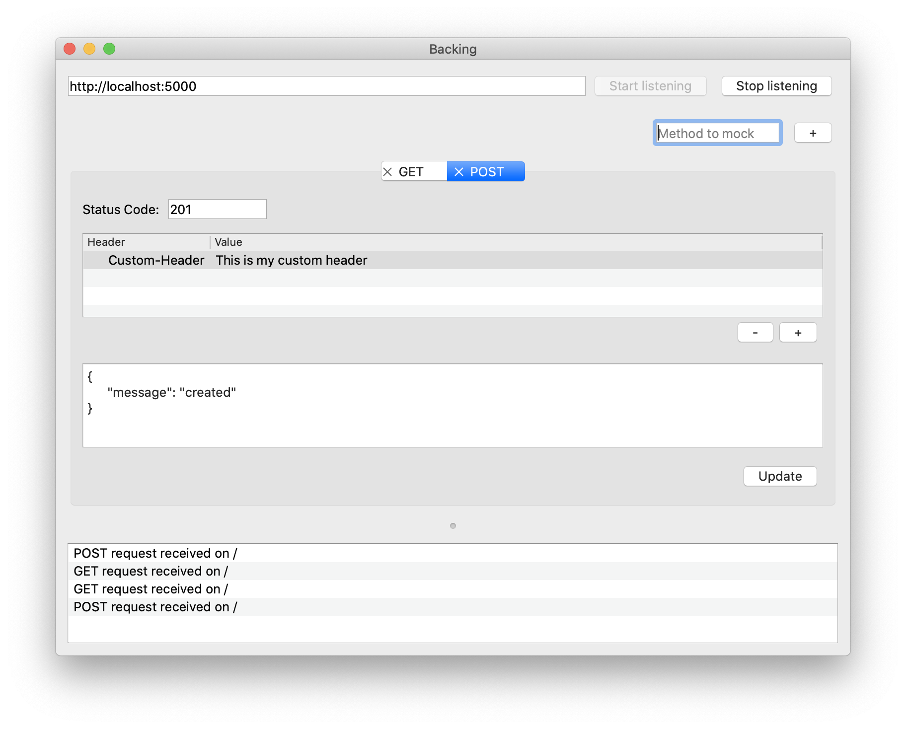

# Backing

[](LICENSE)

[](https://www.codacy.com/manual/bartkessels/backing?utm_source=github.com&amp;utm_medium=referral&amp;utm_content=bartkessels/backing&amp;utm_campaign=Badge_Grade)
[](https://codecov.io/gh/bartkessels/backing)

<br>

|MacOS / Linux|Windows|
|---|---|
|[](https://travis-ci.org/bartkessels/backing)|[](https://ci.appveyor.com/project/bartkessels/backing)|

Application to mock your back-end for front-end testing

## Table of contents

- [1. Screenshots](#1-screenshots)
- [2. Features](#2-features)
- [3. Roadmap](#3-roadmap)
- [4. Required packages](#4-required-packages)
- [5. Build](#5-build)
    - [5.1 MacOS](#51-macos)
    - [5.2 Linux](#52-linux)
    - [5.3 Windows](#53-windows)
- [6. Packaging](#6-packaging)
    - [6.1 Macos](#61-macos)
    - [6.2 Linux](#62-linux)
    - [6.3 Windows](#63-windows)

## 1. Screenshots



## 2. Features

Simply setup a uri and you're able to mock multiple HTTP methods. For each
mocked method you're able to set the status code, headers and ofcourse the body.

All requests will be logged to the output at the bottom of the screen
so you can easily detect if your front-end is sending data to the expected
back-end.

## 3. Roadmap

Unfortunately not all the features we'd like are implemented just yet. Som of the features
we'd like to implement in foreseeable future are:

- Saving the mocks
- Opening the mocks 

There are some things we want get up and running to make life easier for the developers of Backing, mostly for distributing the application.

- Setup GUI test framework

## 4. Required packages

Backing relies on a couple of external packages, some are being fetched using Cmake's `FetchContent` while others
are expected to be installed on your system.

The packages that are fetched by Cmake are [CppRestRequest](https://github.com/microsoft/cpprestsdk), a library from
[Microsoft](https://microsoft.com) to send HTTP requests using an easy C++ interface. This package is both used for
building the `backing` executable as well as the `backing_tests` executable. For the `backing_tests` executable the
[Catch2](https://github.com/catchorg/catch2) library is fetched as the unit-tests framework used by Backing.

The packages you need to install

- `Qt5`, this is used for the GUI of Backing
- `Boost`, these libraries are used within [CppRestSdk](https://github.com/microsoft/cpprestsdk) library
- `CMake`, this is the build system used by Backing


## 5. Build

### 5.1 MacOS

```bash
$ mkdir build
$ cd build
$ cmake ..
$ make
```

After these commands completed you'll get two files in the `bin` folder, one for running the tests and
a `.app` file which you can execute to run Backing.

Use `./bin/backing_tests` to run the tests

Use `open bin/backing.app` to execute the application

### 5.2 Linux

```bash
$ mkdir build
$ cd build
$ cmake ..
$ make
```

After these commands completed you'll get two files in the `bin` folder, one for running the tests and
one for executing Backing itself.

Use `./bin/backing_tests` to run the tests

Use `./bin/backing` to execute the application

### 5.3 Windows

```bat
> mkdir build
> cd build
> cmake ..
> devenv Backing.sln /deploy Release
```

After these commands completed you'll get two files in the `bin/Release` folder, one for running the tests and
one for executing Backing itself.

Use `bin/Release/backing_tests.exe` to run the tests

Use `bin/Release/backing.exe` to execute the application

## 6. Packaging

To install Backing we need to create an installable package for the platform you're currently on.

You can only execute these steps if you've already built the application. The working directory for all the following
platforms is assumed to be `build`.

### 6.1 MacOS

On MacOS we'll create an installer in which you can drag the binary to the applications folder.

By executing the following command you'll get the `Backing-<verion_number>-Darwin.dmg` file in the `build` directory.

```bash
$ cpack -G Bundle
```

### 6.2 Linux

On MacOS we'll create a `bash` script which will install the required `backing` binary on your system. Simply execute this
script with the `--prefix/usr` flag to install it globally.

By executing the following command you'll get the `Backing-<version-number>-Linux.sh` file in the `build` directory.

```bash
$ cpack
``` 

### 6.3 Windows

On Windows we'll create an executable to install Backing into the program files directory.

By executing the following command you'll get the `Backing-<version_number>-Windows.exe` file in the `build` directory.

```bat
> cpack
```